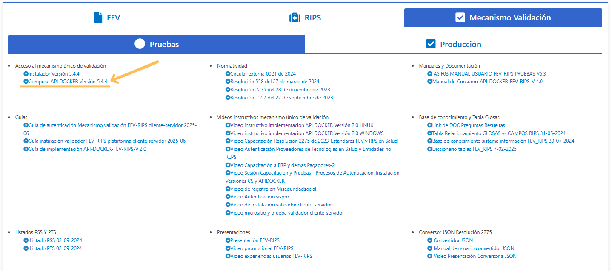
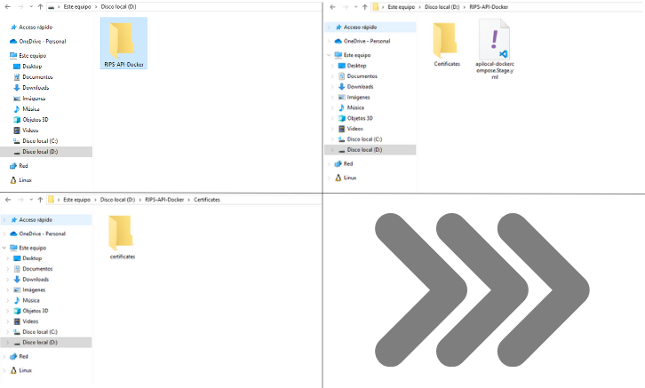
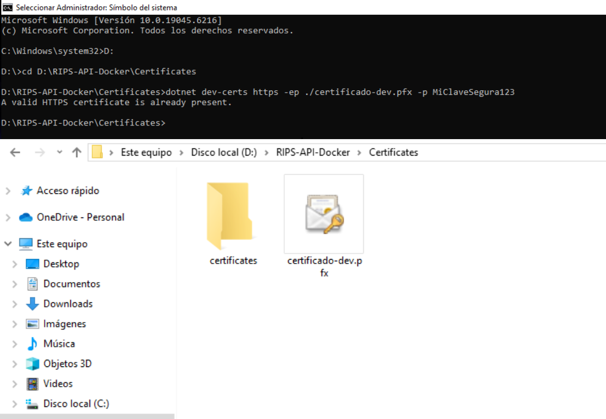
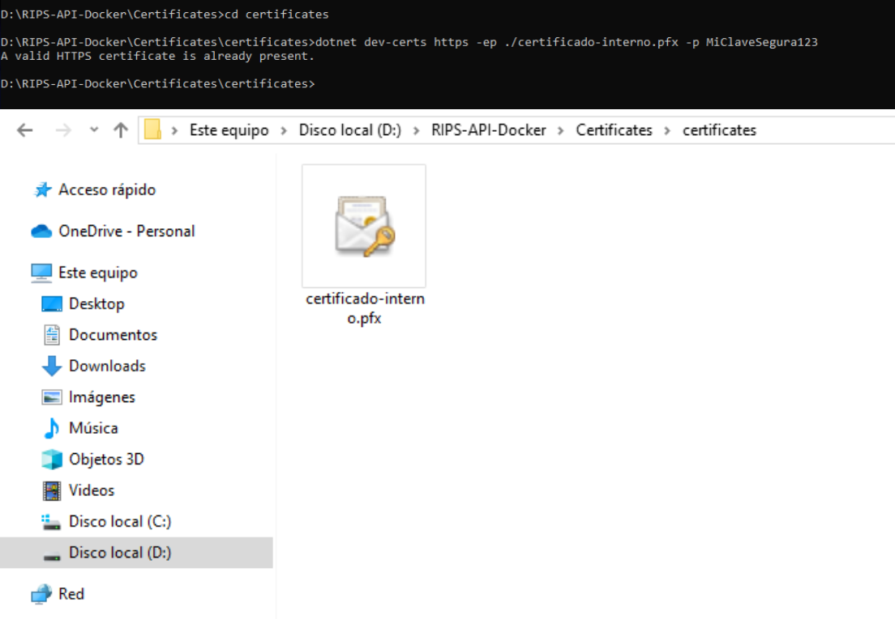
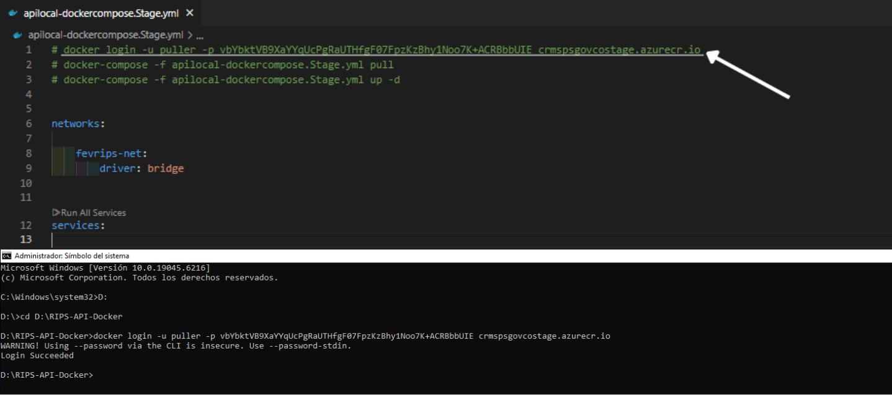
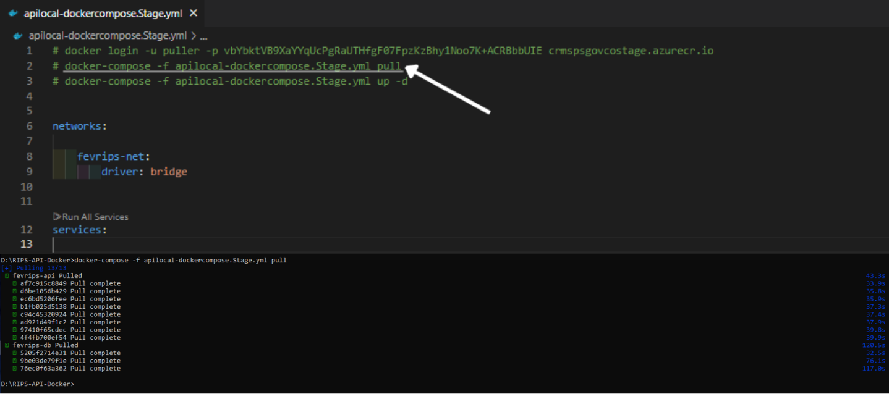
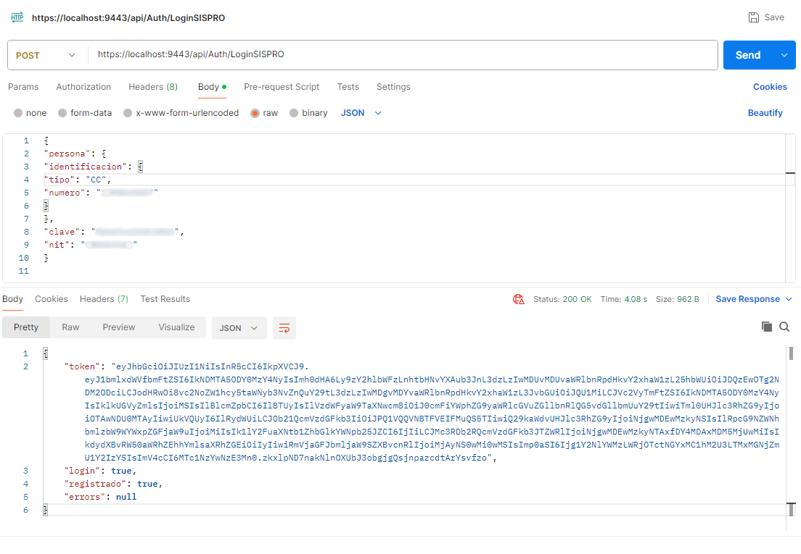

# 🏥 Instalación del Entorno API Docker de Validación de RIPS

## Ministerio de Salud y Protección Social - Colombia

Esta guía te llevará paso a paso para configurar el entorno API Docker para la validación de RIPS del Ministerio de Salud y Protección Social de Colombia.

---

## 📋 Prerrequisitos

Antes de comenzar, asegúrate de tener instalado:

- ✅ **Docker Desktop** - [Descargar aquí](https://www.docker.com/products/docker-desktop/)
- ✅ **.NET SDK** - [Descargar aquí](https://dotnet.microsoft.com/download)
- ✅ **Cliente HTTP** (Postman, Thunder Client, etc.)

> 💡 **Tip**: Verifica que Docker Desktop esté ejecutándose antes de continuar

---

## 🌐 Página Oficial

🔗 **Sitio oficial SISPRO**: https://www.sispro.gov.co/central-financiamiento/Pages/facturacion-electronica.aspx

---

## 🚀 Configuración para Pruebas

### Paso 1: 📥 Descargar el archivo de configuración

1. **Navega** a la página oficial de SISPRO
2. **Busca** la ruta: **"Componentes FEV RIPS"** → **"Mecanismo Validación"** → **"Pruebas"**
3. **Descarga** el archivo `.zip` que contiene la configuración de Docker



---

### Paso 2: 📁 Preparar la estructura de carpetas

#### 2.1 Crear carpeta principal
Crea una carpeta principal en tu ubicación preferida:
```
📁 D:\RIPS-API-Docker\  (recomendado)
```

#### 2.2 Extraer archivos
1. **Extrae** todo el contenido del archivo `.zip` descargado en la carpeta principal
2. **Elimina** el archivo `.zip` una vez extraído

#### 2.3 Crear estructura de certificados
Crea la siguiente estructura **exacta** de carpetas:

```
📁 RIPS-API-Docker/
├── 📄 docker-compose.yml (extraído del .zip)
├── 📁 Certificates/
│   └── 📁 certificates/
```



---

### Paso 3: 🔐 Generar certificados SSL para desarrollo

#### 3.1 Certificado principal
1. **Abre** la terminal/CMD como administrador
2. **Navega** a la carpeta `Certificates`:
   ```bash
   D:
   ```
   ```bash
   cd D:\RIPS-API-Docker\Certificates
   ```

3. **Genera** el certificado principal:
   ```bash
   dotnet dev-certs https -ep ./certificado-dev.pfx -p MiClaveSegura123
   ```

   

#### 3.2 Certificado para subcarpeta
1. **Navega** a la subcarpeta `certificates`:
   ```bash
   cd certificates
   ```
2. **Genera** el certificado interno:
   ```bash
   dotnet dev-certs https -ep ./certificado-interno.pfx -p MiClaveSegura123
   ```

   

#### 📋 Parámetros del comando explicados:
- `-ep`: especifica la **ruta y nombre** del archivo de salida
- `-p`: establece la **contraseña** del certificado

---

### Paso 4: ⚙️ Modificar el archivo docker-compose.yml

Este es un paso **crítico**. Necesitas modificar dos secciones importantes:

#### 4.1 Abrir el archivo
1. **Abre** el archivo `docker-compose.yml` con tu editor de texto favorito
2. **Busca** la sección `environment` y `volumes`

#### 4.2 Modificar configuración
**ANTES** (configuración original):
```yaml
environment:
  - ASPNETCORE_ENVIRONMENT=DockerStage
  - ASPNETCORE_Kestrel__Certificates__Default__Password=fevrips2024*
  - ASPNETCORE_Kestrel__Certificates__Default__Path=/certificates/fevripsapilocal.pfx
volumes:
  - C:\Certificates:/certificates
```

**DESPUÉS** (tu configuración personalizada):
```yaml
environment:
  - ASPNETCORE_ENVIRONMENT=DockerStage
  - ASPNETCORE_Kestrel__Certificates__Default__Password=MiClaveSegura123
  - ASPNETCORE_Kestrel__Certificates__Default__Path=/certificates/certificado-dev.pfx
volumes:
  - D:\RIPS-API-Docker\Certificates:/certificates
```

⚠️ **Importante**: 
- Cambia `D:\RIPS-API-Docker\` por la ruta donde creaste tu carpeta principal
- Asegúrate de que las rutas usen barras invertidas `\` en Windows

---

### Paso 5: 🐳 Iniciar el entorno Docker

#### 5.1 Preparar Docker Desktop
1. **Abre** Docker Desktop
2. **Espera** a que esté completamente iniciado (ícono verde)

#### 5.2 Ejecutar comandos Docker
1. **Abre** terminal/CMD como administrador
2. **Navega** a tu carpeta principal:
   ```bash
   D:
   ```
   ```bash
   cd D:\RIPS-API-Docker
   ```

3. **Ejecuta** los comandos **uno por uno** que se encuentran en **la parte superior/inicial** del archivo .yml (sin el símbolo `#`):

   **1 Comando:** Login al registry
   ⏳ **Espera** a ver "Login Succeeded"

   

   **2 Comando:** Descargar imágenes
   ⏳ **Espera** a que descargue todas las imágenes (puede tomar varios minutos)

   

   **3 Comando:** Iniciar contenedores
   ⏳ **Espera** a que todos los contenedores estén "running"

   

#### 5.3 Verificar estado
Verifica que los contenedores estén ejecutándose:
```bash
docker ps
```

Deberías ver algo similar a:


---

### Paso 6: 🧪 Prueba de funcionamiento

#### 6.1 Importar colección de Postman

Usa la siguiente colección JSON para probar la API:

[📥 Descargar colección de Postman](./media/Validador_Rips.postman_collection.json)

Importa el archivo dentro de tu sesion de Postman

#### 6.2 Configurar variables de entorno

En Postman, configura estas variables:
- `base_url`: `https://localhost:9443`
- `bearer`: (se llenará automáticamente después del login)

#### 6.3 Probar endpoint de login

1. **Selecciona** la request `LoginSISPRO`
2. **Modifica** el body con tus credenciales reales:
   ```json
   {
       "persona": {
           "identificacion": {
               "tipo": "CC",
               "numero": "TU_NUMERO_CEDULA"
           }
       },
       "clave": "TU_CLAVE_SISPRO",
       "nit": "TU_NIT_INSTITUCION",
       "tipoMecanismoValidacion": 0,
       "reps": true
   }
   ```
3. **Envía** la request

   

---

## ✅ Verificación Final

### Lista de verificación:
- [✅] Docker Desktop está ejecutándose
- [✅] Contenedores están en estado "Up"
- [✅] API responde en `https://localhost:9443`
- [✅] Login exitoso en Postman
- [✅] Token se genera correctamente

---

## 🚨 Solución de Problemas Comunes

### Error: "Certificate not found"
**Solución**: Verifica que:
- Los certificados estén en las rutas correctas
- Las contraseñas coincidan en el archivo YML
- Las rutas en `volumes` sean absolutas y correctas

### Error: "Port 9443 already in use"
**Solución**: 
```bash
# Detener contenedores
docker-compose down

# Verificar puertos
netstat -ano | findstr :9443

# Reiniciar
docker-compose up -d
```

### Error: "Docker login failed"
**Solución**: 
- Verifica tu conexión a internet
- Copia y pega el comando exactamente como está
- Reinicia Docker Desktop

---

## 📚 Recursos Adicionales

- 📖 [Documentación oficial SISPRO](https://www.sispro.gov.co/)
- 🐳 [Guía Docker Compose](https://docs.docker.com/compose/)
- 🔒 [Certificados SSL desarrollo](https://docs.microsoft.com/en-us/dotnet/core/additional-tools/self-signed-certificates-guide)

---

*Última actualización: Septiembre 2025*
